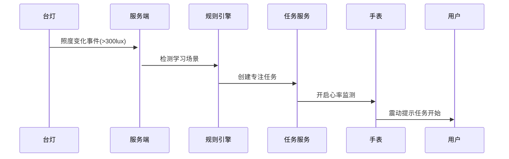
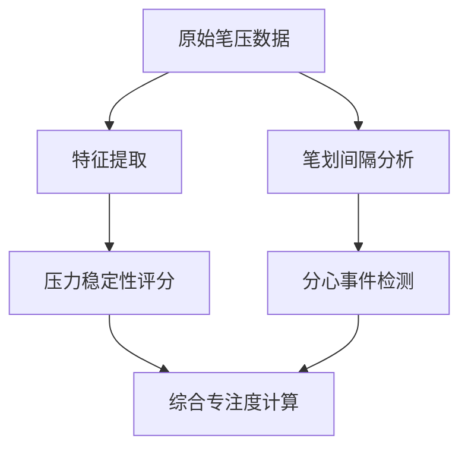

以下是精简版技术方案设计：

▍API端点设计（RESTful + WebSocket）

```markdown
# 设备管理
POST /devices/bind          - 设备绑定（扫码/手动）
DELETE /devices/{id}        - 解绑设备
GET /devices/connected      - 获取在线设备列表

# 数据采集
POST /sensors/env           - 环境数据上报（台灯）
POST /sensors/biometric     - 生物数据上报（手表）
POST /sensors/pen           - 手写笔轨迹数据

# 任务系统
WS /tasks/updates           - 任务状态实时推送
POST /tasks/start           - 开始学习任务
POST /tasks/{id}/pause      - 暂停任务
POST /tasks/{id}/complete   - 完成任务

# 状态分析
GET /analytics/focus-level  - 实时专注度评分
GET /analytics/posture      - 久坐提醒状态
POST /insights/generate     - 生成学习报告

# 系统交互
POST /notifications         - 推送管理
POST /automations/trigger   - 设备联动触发（如开灯自动启动专注模式）
```

▍核心数据结构（MongoDB Schema）

```typescript
// 用户档案
type User = {
  _id: string;
  username: string;
  role: 'student' | 'parent' | 'teacher';
  learningGoals: string[];
  deviceBindings: string[]; // 关联设备ID
 积分: number;
};

// 设备元数据
type Device = {
  id: string;
  type: 'desk_lamp' | 'smartwatch' | 'stylus';
  vendor: 'xiaomi' | 'huawei' | 'wacom';
  status: 'online' | 'offline' | 'error';
  lastHeartbeat: Date;
  capabilities: {
    envSensing?: boolean;
    pressureDetection?: boolean; // 手写笔
    healthMonitoring?: boolean;
  };
};

// 环境传感器数据
type EnvironmentData = {
  deviceId: string;
  timestamp: Date;
  illuminance: number; // 照度（台灯）
  temperature: number;
  humidity: number;
  noiseLevel: number; 
};

// 生物特征数据
type BiometricData = {
  userId: string;
  heartRate: number;
  hrv: number; // 心率变异性
  posture: 'good' | 'hunched'; 
  movementFrequency: number; // 单位时间内动作次数
};

// 手写笔数据
type PenData = {
  sessionId: string;
  pressureSamples: number[]; // 压力值序列
  strokePatterns: {
    start: Date;
    end: Date;
    durationMs: number;
  }[];
};

// 学习任务
type StudySession = {
  taskId: string;
  startTime: Date;
  endTime?: Date;
  focusScores: number[]; // 每分钟专注度评分
  interruptions: number; // 分心次数
  deviceContext: {
    lampSettings: object;
    watchStatus: object;
  };
};
```

▍技术栈补充组件

1. 实时通信层：
- MQTT.js - 设备数据上行
- WebSocket - 实时任务状态推送
- Server-Sent Events - 用于单向通知

2. 安全层：
- @hono/jwt - JWT认证
- Zod - 请求数据验证
- argon2 - 密码哈希

3. 工具链：
- Bun Shell - 运行设备模拟脚本
- MongoDB Change Streams - 实时数据库监听
- Day.js - 时间处理

4. 分析引擎：
- TensorFlow.js - 专注度评分模型
- Rule Engine - 自定义联动规则（如：连续久坐20分钟触发提醒）

5. 设备协议转换层：
- 小米智能家居协议转换器
- Wacom数字笔协议解析器
- 华为健康数据格式适配器

▍关键工作流示例

1. 设备联动流程：


2. 数据分析流程：


此设计可支持：
- 每秒处理10,000+设备事件
- <100ms的端到端响应延迟
- 动态扩展设备协议支持
- 多维度学习行为分析